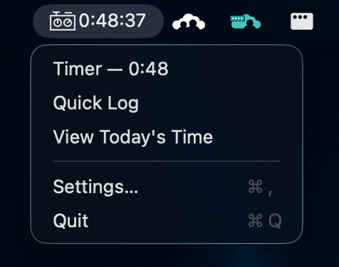
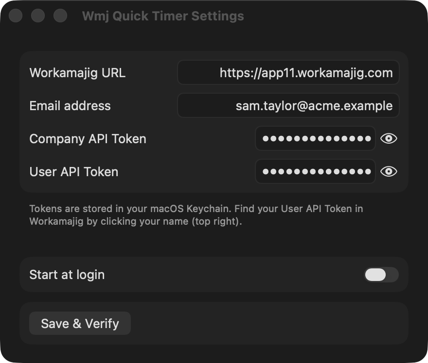

# Installation

## Download and first launch

1. Download the latest `Wmj-Quick-Timer-x.y.z.zip` from the [GitHub Releases page](../../../releases).
2. Unzip it and move **WmjQuickTimer.app** into your **Applications** folder.
3. Double-click to open. The app is signed and notarized by Apple, so it opens like any other app — no security warnings. (If you're upgrading from 0.1.0, which predates notarization, see [Troubleshooting](troubleshooting.md) if macOS complains.)
4. A timer icon appears in the menu bar. There is no Dock icon — this is a menu-bar-only app.

## First-run setup

Click the timer icon and choose **Set Up Workamajig…** — a separate preferences window opens (it stays open while you copy tokens from Workamajig or a password manager).

Fill in:

| Field | Where to find it |
|---|---|
| **Workamajig URL** | The address you use to log in, e.g. `https://app11.workamajig.com` |
| **Your email address** | Your Workamajig login email |
| **Company API Token** | From your Workamajig admin — see [Getting your API tokens](#getting-your-api-tokens) |
| **User API Token** | Yours personally — see [Getting your API tokens](#getting-your-api-tokens) |

The eye button next to each token field reveals what you pasted, so you can check it against Workamajig before saving.

Click **Save & Verify** — you should see "Connected". If you get an "API access is not enabled" error, see [Troubleshooting](troubleshooting.md).

## Getting your API tokens

Every API client needs **two** tokens: one **API Access Token** for the company (generated once by an admin) and one **User Token** that identifies you personally. Workamajig is user-centric — the app acts with exactly the rights of whoever the user token belongs to, so use *your own* token. If that account lacks the right security permissions, Workamajig answers with a 401 (unauthorized).

Which set of steps applies depends on whether your agency runs Workamajig **Platinum** (the current product — if your URL looks like `app11.workamajig.com`, that's you) or **Workamajig Classic**.

### Workamajig Platinum

**API Access Token** — ask an admin to do this once for the whole company:

1. Log into Workamajig
2. Click the **Main Menu**
3. Click **Admin/Manager**
4. Click **System Setup**
5. Click **Connections**
6. Click **API**
7. Click **Generate New Company Token** - only do this if a token does not already exist

> The same screen has a button to generate system-wide user tokens. Avoid it: generating them overwrites every previously issued user token. Workamajig recommends creating user tokens individually as employees are added.

**User Token** — two places, depending on what you need:

*Click your name* (Workamajig 10.6.2.2 and later) — the only way to **generate** your own:

1. Sign into Workamajig
2. Click your name in the top right
3. Scroll toward the bottom for **API User Token** — generate and copy it there

*Employee screen* (view only, admin access — you can read a token here but not generate one):

1. Sign into Workamajig
2. Click the **Main Menu**
3. Click **Admin/Manager**
4. Click **Employees**
5. Choose an employee
6. Choose **Security Controls**
7. On the right, find **API User Token** — note this is *not* the Auth Token

### Workamajig Classic

**API Access Token** — an admin generates it under API Settings:

1. Log into Workamajig
2. Click the **Main Menu**
3. Click **Admin**
4. Choose **System Setup**
5. Choose **Transaction Preferences**
6. Click **Generate New Token**

**User Token** — open the **My Settings** screen and look under **Login Information** to generate an API user token.

## About the Keychain prompt

The first time the app reads your tokens after an install or update, macOS shows a dialog like *"WmjQuickTimer wants to use your confidential information stored in ... in your keychain."*

That is macOS asking your permission, not the app phoning home:

- Both tokens are stored in your **macOS Keychain** (one encrypted item), never in a plain-text file and never anywhere outside your Mac.
- The only thing that ever leaves your machine is an API request to **your company's Workamajig server**, carrying those tokens as authentication.
- Enter your login password and click **Always Allow** to stop the prompt for good.

Every release is signed with the same Apple Developer ID, so the Keychain treats updates as the same app — after you click **Always Allow** once, updates won't ask again. (One exception: upgrading from 0.1.0, which was signed differently, triggers the prompt one last time.) If you'd rather clear it out entirely, search for `com.moosylvania.WmjQuickTimer` in **Keychain Access** to see, or delete, exactly what's stored.

## Updating

The app checks GitHub for a new release when it launches and twice a day while it's running. You don't need to do anything to stay current.

When a newer version exists, **Update to X.Y.Z…** appears at the top of the menu bar menu (and macOS shows a notification the first time). Choosing it opens a window with that version's release notes and a **Download & Install** button:

1. The release is downloaded from GitHub.
2. Its signature is checked — an app that isn't signed by Moosylvania is never installed.
3. The installed app is replaced and reopens itself. Your settings, tokens, and any running timer are untouched.

If the app can't write to where it's installed (for example, it's in a folder you don't have permission to change), the new version is saved to your **Downloads** folder and revealed in Finder — drag it into **Applications** to finish, replacing the old copy.

You can check on demand any time from **Settings**, which also shows the version you're running.

## Start at login

In the app's Settings, enable **Start at login** so the timer is always available. (This only works when the app is run from the `.app` bundle in Applications, not when launched via `swift run` during development.)
