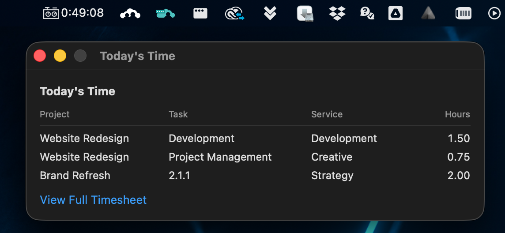

# Using Wmj Quick Timer

Click the timer icon in the menu bar for a short menu:

- **Add Timer** (or **Timer — X:XX** while one is running) — opens the timer window
- **Quick Log** — opens the quick log window
- **View Today's Time** — shows what's already on today's timesheet
- **Settings…** and **Quit**

Each action opens its own small window that stays put while you work in other apps. Both are always available — you can quick-log hours while a timer is running.

The windows also open without the menu — handy when a crowded menu bar or the notch hides the icon: press **⌃⌥T** (Timer) or **⌃⌥L** (Quick Log) from any app, or launch Wmj Quick Timer again from Spotlight (see [Troubleshooting](troubleshooting.md#the-menu-bar-icon-is-missing)).

## Quick Log

Log a block of time in one shot:

1. Type in **Search projects…** — matches (by number, name, or client) drop down as you type; click one or press Return to take the top match. The ⓧ clears it. Projects you've logged time to recently sort to the top.
2. Pick the **Task**. The list shows only tasks that are still open **and** are either assigned to you or unassigned — completed tasks and other people's tasks are hidden. If nothing qualifies, the form says so and you can't submit. (If there's only one task it's selected automatically.)
3. Pick the **Service** — it starts on the service you last logged with (falling back to your Workamajig default).
4. Enter **Hours**: decimals in quarter-hour steps, from `0.25` up to `8` (e.g. `1.75`). The stepper moves in 0.25 increments.
5. The **Date** defaults to today — change it to log time to a different day.
6. Click **Submit**. "Logged ✓" confirms the entry landed on that day's timesheet.

Submitting **adds to your day, never overwrites it**: if that day already has a row for the same project, task, and service, the hours are added to that row's total; otherwise a new row is created. Time you've logged is never replaced or lost.

## Timer

1. Click **Add Timer**, pick Project / Task / Service, click **Start** — the window closes itself. Starting first confirms with Workamajig that you can log time to that job: if you can't (for example, you're not on the project team), the timer won't start and the reason is shown. The check places a 0-hour entry on today's timesheet unless one for that job is already there; your submitted time later merges into it. Being offline never blocks a timer.

	
2. The menu bar icon switches to a live **⏱ h:mm** counter. Reopen **Timer** any time to see the full `h:mm:ss` elapsed time.

	
3. Click **Stop** when you're done (or pausing). You then have three choices:
   - **Resume** — keep the timer going from where it stopped.
   - **Submit Time** — logs the elapsed time to today's timesheet, **rounded up to the next quarter hour** (minimum 0.25 — 16 minutes logs 0.5). If today already has a row for that project/task/service the hours are **added to its total**; otherwise a new row is created — existing time is never overwritten. The panel shows the exact hours that will be logged before you click.
   - **Discard** — throws away the timer and its project/task selection.
   - **Change Project…** — re-pick the project/task/service without losing the elapsed time. Use this if submitting fails because you can no longer log time to the original job (project closed, access changed) — pick a valid task and submit again.

Notes:

- Only **one timer** can run at a time.
- The timer keeps counting while your Mac sleeps, and **survives quitting or restarting the app** — it's based on wall-clock time, not a running counter.

## View Today's Time

A quick read-only check of what you've already logged today: a table of project, task, service, and hours for each entry on today's timesheet. (The 0-hour placeholder entries the timer's pre-start check creates are hidden.) **View Full Timesheet** at the bottom opens your Workamajig site in the browser.

The table refreshes each time the window opens — a **Syncing…** indicator next to the title shows while the latest entries load. A window left open past midnight automatically reloads for the new day.

## Settings

Choose **Settings…** from the menu to open the preferences window, where you can change the Workamajig URL, email, tokens, or the **Start at login** option. **Save & Verify** re-checks the connection. The window stays open while you switch apps to copy tokens.
