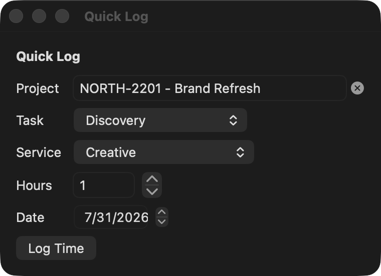
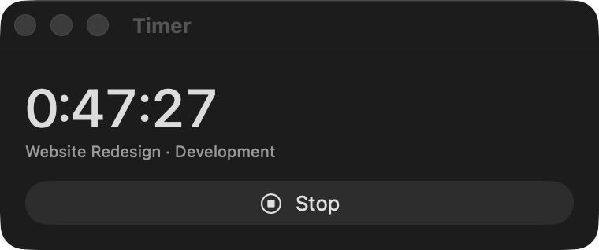
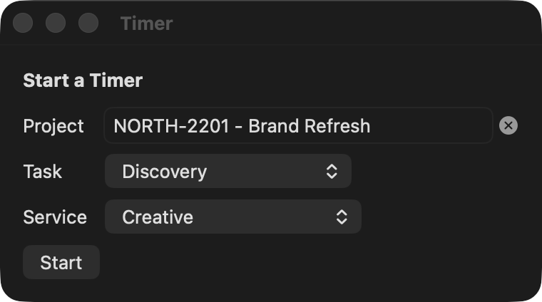

# Using Wmj Quick Timer

Click the timer icon in the menu bar for a short menu:

- **Add Timer** (or **Timer — 0:42** while one is running) — opens the timer window
- **Quick Log** — opens the quick log window
- **Settings…** and **Quit**

Each action opens its own small window that stays put while you work in other apps. Both are always available — you can quick-log hours while a timer is running.

## Quick Log

Log a block of time in one shot:

1. Type in **Search projects…** — matches (by number, name, or client) drop down as you type; click one or press Return to take the top match. The ⓧ clears it.
2. Pick the **Task** (the list loads from the project; if there's only one task it's selected automatically).
3. Pick the **Service** — it defaults to your Workamajig default service.
4. Enter **Hours**: decimals in quarter-hour steps, from `0.25` up to `8` (e.g. `1.75`). The stepper moves in 0.25 increments.
5. The **Date** defaults to today — change it to log time to a different day.
6. Click **Submit**. "Logged ✓" confirms the entry landed on that day's timesheet.

Submitting **adds to your day, never overwrites it**: if that day already has a row for the same project, task, and service, the hours are added to that row's total; otherwise a new row is created. Time you've logged is never replaced or lost.

## Timer

1. Click **Add Timer**, pick Project / Task / Service, click **Start** — the window closes itself.

   
2. The menu bar icon switches to a live **⏱ h:mm** counter. Reopen **Timer** any time to see the full `h:mm:ss` elapsed time.
3. Click **Stop** when you're done (or pausing). You then have three choices:
   - **Resume** — keep the timer going from where it stopped.
   - **Submit Time** — logs the elapsed time to today's timesheet, **rounded up to the next quarter hour** (minimum 0.25 — 16 minutes logs 0.5). If today already has a row for that project/task/service the hours are **added to its total**; otherwise a new row is created — existing time is never overwritten. The panel shows the exact hours that will be logged before you click.
   - **Discard** — throws away the timer and its project/task selection.

Notes:

- Only **one timer** can run at a time.
- The timer keeps counting while your Mac sleeps, and **survives quitting or restarting the app** — it's based on wall-clock time, not a running counter.

## Settings

Choose **Settings…** from the menu to open the preferences window, where you can change the Workamajig URL, email, tokens, or the **Start at login** option. **Save & Verify** re-checks the connection. The window stays open while you switch apps to copy tokens.
